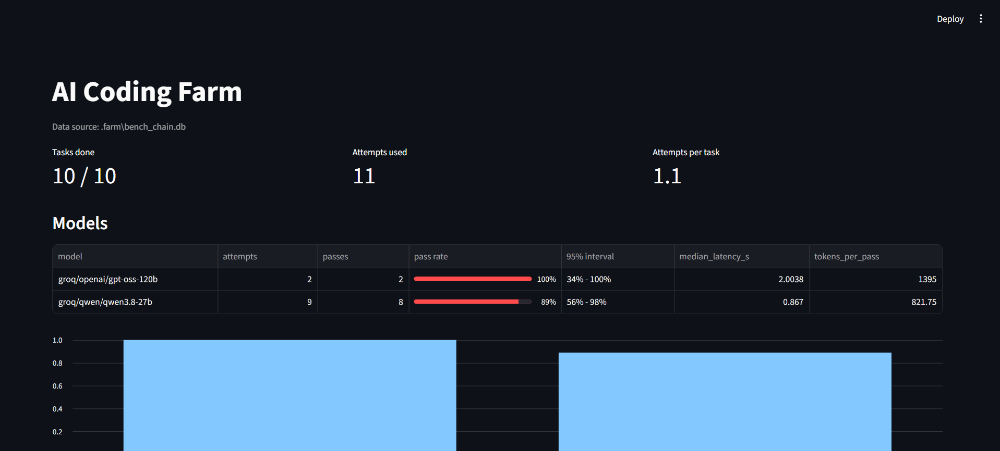
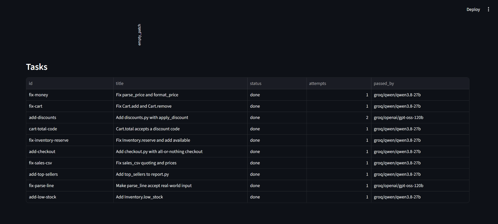

# AI Coding Farm

A small system that gives coding tasks to AI models, **checks every answer with
plain code**, and records which model is good at what.

The idea: a weak model with a strict checker is safer than a strong model with no
checker. The checker (the *gatekeeper*) is normal code. It uses no AI.

- Runs at zero cost: free API tiers. Local models (for example Ollama) should work
  through LiteLLM (`ollama/<model>` in `models.yaml`), but I have not benchmarked one yet.
- Models are changed by editing one line in `models.yaml`.
- Every attempt is saved in SQLite, so you can measure the models instead of guessing.

## Try it in one minute (no API keys)

```bash
pip install pyyaml pytest
python -m farm demo
```

The demo uses fake models. One is weak (wrong on purpose), one is strong. You will see:

- 4 small tasks fixed on a separate git branch (`farm/demo`), one commit each
- the weak model being rejected for 3 different reasons
- a report with pass rates and confidence intervals

Run the tests: `python -m pytest -q`

Dashboard (needs `pip install streamlit pandas`):

```bash
streamlit run dashboard.py -- --db .farm/demo.db
```

## How it works

```
tasks.json --> queue (SQLite) --> router --> model --> worker (parse answer)
                                    ^                        |
                                    |                        v
                          next attempt uses            gatekeeper (no AI)
                          a stronger model  <-- rejected --+--> passed --> git commit
```

1. **Queue.** Tasks live in SQLite. A task can depend on other tasks. If a
   dependency fails, the task is marked `blocked` and never tried.
2. **Router.** `models.yaml` lists models per role, cheapest first. Attempt 1 uses
   the first model. If the gatekeeper rejects it, attempt 2 uses the next one
   (*escalation*). If a model call fails (outage, rate limit), the router first
   waits and retries the same model (up to 3 tries, as long as the provider asks),
   then tries the next model (*API fallback*).
3. **Worker.** Sends the task and the allowed files. The model must answer with
   complete files. It only sees the *trimmed test output* of the last failure,
   never a long history.
4. **Gatekeeper.** Rejects the patch if:
   - it contains no files in the right format (`empty_patch`)
   - a path is unsafe (`bad_path`)
   - a file is not in the task's `files_allowed` list (`not_allowed`)
   - it contains "rest of the code" laziness (`placeholder`)
   - a big file lost more than 40% of its lines (`shrunk`)
   - the task's tests fail or time out (`tests_failed`, `timeout`)

   The tests run in a **temporary copy**. The real repo is only changed after
   everything passes.
   If the model APIs are down (outage, rate limit), the farm waits and retries.
   That is **not** counted as an attempt and does not fail the task. A task that
   still cannot run becomes `unavailable`, and running the same command again
   continues where it stopped.
5. **Git.** Passing work is committed to one branch, one commit per task.
   The farm never touches `main`. You review and merge.
6. **Log and report.** Every attempt and every API call is saved. `python -m farm report`
   shows pass rate (with a 95% Wilson interval), median time, and tokens per
   passing attempt.

## Results

I ran 10 harder tasks (`examples/bench_target`: a small shop with money, cart,
discounts, stock, checkout and CSV code) on free Groq models. Every task has a
reference solution, and a test proves that it fails before the fix and passes after.



**Each model alone** (one run each, all 10 tasks, up to 3 attempts per task):

| Model | Tasks solved | Attempts that passed | 95% interval | Tokens per pass |
|---|---|---|---|---|
| openai/gpt-oss-120b | 10 / 10 | 10 / 10 (100%) | 72% - 100% | 1354 |
| openai/gpt-oss-20b (two runs added up) | 10 / 10 each | 20 / 28 (71%) | 53% - 85% | about 2590 |
| qwen/qwen3.8-27b | 10 / 10 | 10 / 14 (71%) | 45% - 88% | 1208 |
| openai/gpt-oss-20b, `reasoning_effort: low` | 7 / 10 | 7 / 13 (54%) | 29% - 77% | 2108 |

The two runs of gpt-oss-20b with the same settings gave 10 / 12 (83%) and 10 / 16 (62%).



**The chain** (`qwen3.8-27b`, then `gpt-oss-120b`): 10 / 10 tasks in 11 attempts.
Both safety nets were used:
- *Escalation:* `add-discounts` got an empty answer from the first model, so the
  next attempt went to the stronger model and passed.
- *API fallback:* `fix-parse-line` hit a rate limit on the first model, so the
  the router waited, retried, and then used the next model.

What this does and does not show:
- All the intervals overlap, so I do **not** rank any model above another.
  gpt-oss-120b has the highest pass rate, but it is not clearly better.
- The same model moved a lot between two runs (83% and 62% for gpt-oss-20b).
  That is the real size of the noise here.
- Turning down the "thinking" of the 20b model (`reasoning_effort: low`) removed its
  empty answers, but it gave more wrong code. I see no clear gain or loss.
- One or two runs per model is a small sample.
- The tasks are small and made by me. They show how the farm behaves, not how good
  a model is in general.
- I tried `gemini-3.8-flash` too, but the free key allows only 20 requests per day,
  so it could not be measured.
- A failed API call (rate limit, outage) is **not** counted as a wrong answer. The
  farm waits and retries. This changed my first numbers a lot: before that fix,
  rate limits looked like model failures.

## Use it on your own repo

1. Get the code and install everything (the demo above needs less, real models need litellm):
   ```bash
   git clone https://github.com/KDiamantidis/ai-coding-farm
   cd ai-coding-farm
   pip install -r requirements.txt
   ```
   Run the commands below from this folder: `models.yaml` and `.env` are read from the
   current folder.
2. Create a free key (Groq is enough) and copy `.env.example` to `.env`. Put the key
   in `.env`, never in `.env.example`.
3. Check the model names in `models.yaml`. Free-tier names change often.
4. Write a `tasks.json` (see `examples/demo_target/tasks.json`). Each task needs a
   `test_cmd` that fails now and passes when the task is done.
5. Run:

```bash
python -m farm --db farm.db add tasks.json
python -m farm --db farm.db run --repo /path/to/your/repo
python -m farm --db farm.db report
```

You can run the same `run` command again. It continues where it stopped, and it keeps
working on the same git branch (`farm/run`), so earlier commits are never lost.

### Compare models on harder tasks

`examples/bench_target` has 10 tasks across several files (float rounding,
all-or-nothing checkout, CSV quoting). A test proves that every task fails on the
starting code and passes with a reference solution, so no task is unfair.

```bash
python -m farm bench --tag chain                                   # the whole chain
python -m farm bench --models models.only-gpt-oss-120b.yaml --tag 120b   # one model alone
python -m farm --db .farm/bench_120b.db report
python -m farm --db .farm/bench_120b.db debug    # API errors and rejected answers
```

Compare models only with the "one model alone" runs. In a chain run the second
model only sees the tasks the first one failed, so its numbers are not comparable.

### Run several tasks at the same time (optional)

```bash
python -m farm bench --tag fast --workers 3
python -m farm --db farm.db run --repo /path/to/repo --workers 3
```

Or set `workers: 3` under `settings:` in `models.yaml`. The default is 1. Waiting for the
model and running the tests overlap; writing files and `git commit` take turns, so the
branch stays clean. A task waits if it depends on an unfinished task, or if it could edit a
file that a running task edits or reads. Free API tiers limit tokens per minute, so more
workers mean more waiting on rate limits (the farm waits as long as the provider asks).
Compare models with `--workers 1`, so the timing numbers stay comparable.

### Run the tests inside Docker (optional)

By default the gatekeeper runs the task's tests on your machine, in a temporary copy.
Code written by a model can still use your network or CPU. With Docker the tests run in
a throw-away container: no network, 512 MB memory, 1 CPU, read-only root file system,
all Linux capabilities dropped. Only the temporary copy is mounted, never your repo.

```bash
python -m farm sandbox-build          # once; builds docker/Dockerfile (python + pytest)
# then in models.yaml:  settings: sandbox: docker
```

If Docker is not running or the image is missing, the run stops at the start with a clear
message. That is a setup error and is never counted against a model. A test that needs
extra packages must have them installed in `docker/Dockerfile`, because there is no network.

Windows tip: if a package fails to install on a very new Python, make a
virtual environment with Python 3.12 (`uv venv --python 3.12`).

## Before you push this to GitHub

- Run `gitleaks detect` on the repo.
- Check that `.env` and `*.db` are not tracked (they are in `.gitignore`).
- Set the git name and email for this repo only (not global).
- Check `git log` for lines you do not want.

## Project layout

```
farm/config.py        read models.yaml and .env
farm/db.py            SQLite: tasks, attempts, calls
farm/router.py        model choice, fallback, call log
farm/worker.py        prompt and answer parser
farm/gatekeeper.py    all the checks (no AI)
farm/sandbox.py       optional Docker container for the test step
docker/Dockerfile     image for that container
farm/orchestrator.py  the loop, escalation, parallel workers, git commits
farm/stats.py         the only place statistics are computed
farm/cli.py           python -m farm ...
dashboard.py          Streamlit view of the log
examples/demo_target  the offline demo project, tasks and mock answers
examples/bench_target the 10 harder tasks, with reference solutions (`reference/`)
docs/                 dashboard screenshots
tests/                46 tests (including a check that every benchmark task is fair)
```

## Limits (what this version does not do)

- The offline demo is tested. The real-model path is only tested with a stand-in
  for LiteLLM, because it needs network and keys. Expect to fix small things on the
  first real run.
- Parallel workers only help when tasks are independent. Tasks that depend on each other, or
  that edit the same file, still run one after the other. Free-tier token limits per minute
  also cap the speed.
- The tests in `tasks.json` are only as good as you write them. The gatekeeper cannot
  catch a bug that your tests do not cover.
- With few tasks, the confidence intervals are wide. That is correct. Do not
  compare two models whose intervals overlap.

## Roadmap

- A private evaluation set from your own repos, and a "shadow mode" before a new
  model is promoted.
- A small learned router, only if it beats the YAML rules on the logged data.
- React dashboard.
- More roles: reviewer, test writer, planner.
